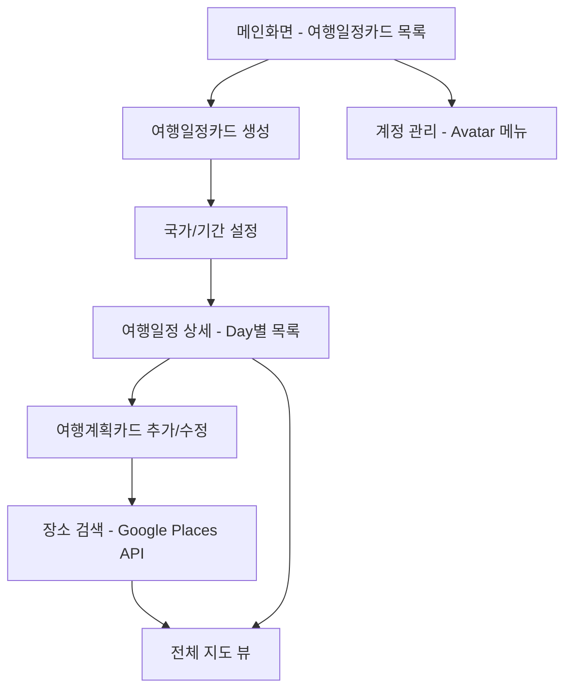

# Moonwave Travel v3.0 🌍✈️

모바일 여행 플래너 웹서비스 - 여행의 시작부터 끝까지 All-in-One 관리

> "가짜 흐름이 아닌, 실제 흐름으로 설계한다" - Moonwave 여행 플래닝 시스템

## 📋 프로젝트 개요

**Moonwave Travel**은 **Pretendard 한글 최적화 타이포그래피**와 **Container Queries 반응형 시스템**을 활용해 직관적이고 아름다운 여행 계획 경험을 제공하는 실시간 여행 플래닝 웹서비스입니다.

### 🎯 핵심 기능
- **여행일정카드 생성** - 여행 국가와 기간 선택, 실시간 일정 자동 생성
- **여행계획카드 등록** - Day별로 사진, 시간, 장소, 메모 등 상세 계획 기록
- **Google Maps 통합** - 장소 검색 시 Google Places API 실시간 연동
- **전체 일정 지도 뷰** - 모든 계획을 지도 위에서 시각화
- **실시간 협업** - 여행 동반자 간 실시간 일정 공유 및 편집

### 👥 타겟 사용자
25-40세 여행 애호가, 체계적 계획 선호, **"아름다운 여행 기록을 남기고 싶지만 복잡한 도구는 싫어하는 밀레니얼"**

### 🌟 Moonwave 차별화 요소
- **한글 최적화**: Pretendard 폰트로 한국 여행지명 완벽 표현
- **Container 기반 반응형**: 여행카드가 컨테이너 크기에 따라 지능적 배치
- **실시간 동기화**: Supabase Realtime 기반 여행 동반자 간 실시간 일정 공유
- **GitHub Pages 배포**: travel.moonwave.kr 안정적이고 빠른 서비스 제공

## 🚀 주요 기능

### 1. 여행일정카드 관리
- 여행 제목, 목적지, 기간 설정 (Pretendard 폰트 적용)
- Container Queries 기반 카드 레이아웃 (@container 활용)
- 실시간 데이터 저장 (Supabase Realtime)
- 여행카드 리스트 뷰 (그리드 반응형)

### 2. Day별 여행계획카드 시스템
- Day별 자동 생성 및 순서 관리
- 장소, 시간, 사진, 메모 입력 (한글 최적화 입력 필드)
- Google Places API 자동 완성
- 여행 유형별 Badge 컴포넌트 (Moonwave 컬러 시스템)

### 3. Google Maps 통합 시각화
- Google Maps 통합 (마커, 경로 표시)
- Container Queries 기반 지도 레이아웃
- 모바일 최적화 BottomSheet
- 계획 카드 연동 (클릭 시 상세 정보)

### 4. 실시간 협업 기능
- 여행 동반자 초대 및 공유 편집
- 실시간 댓글 및 제안 시스템
- Supabase Realtime 기반 동기화

## 🛠 기술 스택

### Frontend (Next.js First)
- **Next.js 14** - App Router 기반 Static Export
- **TypeScript** - 타입 안정성
- **Tailwind CSS 4** - Utility-First 스타일링
- **Pretendard Font** - 한글 최적화 타이포그래피
- **Container Queries** - 지능적 반응형 레이아웃
- **Lucide React** - 아이콘 시스템

### Backend & Database
- **Supabase PostgreSQL** - 실시간 데이터베이스
- **Supabase Auth** - Magic Link 인증
- **Supabase Realtime** - 실시간 동기화
- **Supabase Storage** - 이미지/파일 저장

### 외부 API 연동
- **Google Maps JavaScript API** - 지도 및 시각화
- **Google Places API** - 장소 검색 및 자동완성

### 배포 및 인프라
- **GitHub Pages** - Static Export 기반 배포
- **GitHub Actions** - 자동 배포 파이프라인
- **Custom Domain** - travel.moonwave.kr

## 🎨 디자인 시스템

### Moonwave Design System 특징
- **Utility-First CSS**: Tailwind CSS 기반 원자적 디자인
- **Pretendard Typography**: 한글 최적화 타이포그래피 시스템
- **Container Queries**: @container 기반 지능적 반응형 레이아웃
- **Component Abstraction**: 반복 패턴의 컴포넌트 추상화

### 색상 팔레트
```css
/* Moonwave Color System */
:root {
  --moonwave-primary-500: #3b82f6;
  --moonwave-primary-600: #2563eb;
  --moonwave-secondary-500: #8b5cf6;
  --moonwave-gray-900: #111827;
  --moonwave-success: #16a34a;
  --moonwave-warning: #f97316;
  --moonwave-error: #dc2626;
}
```

### 타이포그래피 시스템
```css
/* Pretendard 기반 타이포그래피 */
:root {
  --font-pretendard: "Pretendard Variable", Pretendard, -apple-system, 
                     BlinkMacSystemFont, system-ui, sans-serif;
}

.font-pretendard {
  font-family: var(--font-pretendard);
  font-feature-settings: 'cv01', 'cv02', 'cv03', 'cv04';
}
```

### 컴포넌트 시스템
- **Button**: 다양한 variant와 size 지원 (primary, secondary, destructive, ghost)
- **Card**: Container Queries 기반 반응형 카드 시스템
- **Badge**: 여행 유형 및 상태 표시
- **Input**: 한글 최적화 입력 필드
- **TravelCard**: 여행일정 전용 카드 컴포넌트
- **DayPlanCard**: Day별 계획 카드 컴포넌트

## 📱 사용자 플로우



## 🗄 데이터베이스 구조

### 핵심 테이블 (Supabase PostgreSQL)

```sql
-- 사용자 프로필
CREATE TABLE profiles (
  id UUID PRIMARY KEY REFERENCES auth.users(id),
  email TEXT UNIQUE NOT NULL,
  name TEXT,
  avatar_url TEXT,
  preferences JSONB,
  created_at TIMESTAMP DEFAULT NOW()
);

-- 여행 계획
CREATE TABLE travel_plans (
  id UUID PRIMARY KEY DEFAULT gen_random_uuid(),
  user_id UUID REFERENCES profiles(id),
  title TEXT NOT NULL,
  destination TEXT,
  start_date DATE,
  end_date DATE,
  cover_image_url TEXT,
  is_public BOOLEAN DEFAULT FALSE,
  metadata JSONB,
  created_at TIMESTAMP DEFAULT NOW()
);

-- 일자별 계획
CREATE TABLE travel_days (
  id UUID PRIMARY KEY DEFAULT gen_random_uuid(),
  travel_plan_id UUID REFERENCES travel_plans(id),
  day_number INTEGER,
  date DATE,
  title TEXT,
  created_at TIMESTAMP DEFAULT NOW()
);

-- 세부 계획
CREATE TABLE day_plans (
  id UUID PRIMARY KEY DEFAULT gen_random_uuid(),
  travel_day_id UUID REFERENCES travel_days(id),
  place_name TEXT,
  google_place_id TEXT,
  latitude DECIMAL,
  longitude DECIMAL,
  planned_time TIME,
  plan_type TEXT,
  notes TEXT,
  image_urls TEXT[],
  youtube_url TEXT,
  order_index INTEGER,
  metadata JSONB,
  created_at TIMESTAMP DEFAULT NOW()
);
```

### Row Level Security (RLS) 정책
```sql
-- 사용자별 데이터 격리
ALTER TABLE travel_plans ENABLE ROW LEVEL SECURITY;
CREATE POLICY "Users can only see their own travel plans" 
ON travel_plans FOR ALL USING (auth.uid() = user_id);
```

## 🔌 API 구조

### Supabase Client SDK 기반 API

```typescript
// 여행 계획 조회
const { data: travelPlans, error } = await supabase
  .from('travel_plans')
  .select(`
    *,
    travel_days (
      *,
      day_plans (*)
    )
  `)
  .eq('user_id', userId);

// 실시간 구독
const subscription = supabase
  .channel('travel_plans')
  .on('postgres_changes', {
    event: '*',
    schema: 'public',
    table: 'travel_plans'
  }, handleRealTimeUpdate)
  .subscribe();
```

### Google Maps API 연동

```typescript
// 장소 검색
const placesService = new google.maps.places.PlacesService(map);
placesService.findPlaceFromQuery({
  query: searchQuery,
  fields: ['place_id', 'name', 'geometry', 'rating', 'opening_hours']
}, handlePlaceResults);
```

## 📊 성공 지표 (KPI)

- **사용자 참여**: 첫 일정 생성/저장까지 평균 3분 이내
- **활성 사용자**: 일평균 사용자(DAU) 100명 이상 (초기 목표)
- **콘텐츠 생성**: 일정카드별 평균 계획 등록 5건 이상
- **개발 속도**: 사용자 피드백 기반 기능 개선 주기 2주 이내

## 📅 개발 로드맵

### Phase 1: MVP (완료) ✅
- 핵심 기능 개발 및 런칭
- 여행카드, 계획카드, 지도연동
- Pretendard 폰트 + Container Queries 적용

### Phase 2: 실시간 협업 (진행중) 🔄
- Supabase Realtime 기반 실시간 동기화
- 여행 동반자 초대 및 공유 편집
- 실시간 댓글 및 제안 시스템

### Phase 3: 고도화 (계획) 📋
- 여행 회고 및 기록 강화
- SNS 스타일 여행 스토리 생성
- PDF/이미지 앨범 내보내기
- 여행지 큐레이션 및 추천

## 🔧 설치 및 실행

```bash
# 프로젝트 클론
git clone https://github.com/moonwave/travel-planner.git
cd moonwave-travel

# 의존성 설치
npm install

# 환경 변수 설정
cp .env.example .env.local

# 개발 서버 실행
npm run dev

# Static Export 빌드 (GitHub Pages 배포용)
npm run build
npm run export
```

### 환경 설정
```bash
# .env.local 파일 생성
NEXT_PUBLIC_SUPABASE_URL=your_supabase_url
NEXT_PUBLIC_SUPABASE_ANON_KEY=your_supabase_anon_key
NEXT_PUBLIC_GOOGLE_MAPS_API_KEY=your_google_maps_api_key
NEXT_PUBLIC_GOOGLE_PLACES_API_KEY=your_google_places_api_key
```

## 📝 개발 문서

프로젝트 관련 상세 문서는 `Docs/` 폴더에서 확인할 수 있습니다:

### 기획 문서
- **PRD** - 제품 요구사항 문서 (Product Requirements Document)
- **화면정의서.md** - UI/UX 화면 정의서
- **Phase별 세부작업을 체크리스트** - 개발 단계별 체크리스트

### 기술 문서
- **기술아키텍처** - Next.js 기반 시스템 아키텍처
- **API명세서** - Supabase Client SDK 기반 API 문서
- **ERD** - 데이터베이스 설계서 (Entity Relationship Diagram)
- **개발 프로세스 가이드** - GitHub 연동 개발 프로세스

### 디자인 문서
- **Desgin Guid** - Pretendard + Container Queries 디자인 시스템
- **컴포넌트 라이브러리** - 재사용 가능한 UI 컴포넌트 라이브러리

### AI 개발 문서
- **AI 개발 가이드** - Cursor AI 기반 개발 가이드라인
- **개발 문서 체크리스트** - 코드 품질 및 표준 준수 체크리스트
- **테스트전략** - 실제 데이터 기반 테스트 전략

## 🎨 Moonwave Design System

### 핵심 설계 원칙
- **Utility-First**: Tailwind CSS 기반 원자적 스타일 조합
- **Pretendard Typography**: 한글 최적화 타이포그래피 시스템
- **Container Queries**: @container 기반 지능적 반응형 설계
- **Component Abstraction**: 반복 패턴의 컴포넌트 추상화

### 컴포넌트 스페이싱
```css
/* Moonwave Container System */
.container-moonwave {
  @apply max-w-7xl mx-auto px-4 sm:px-6 lg:px-8;
}

.card-moonwave {
  @apply rounded-lg border border-gray-200 bg-white shadow-sm p-6;
  @apply hover:shadow-lg hover:scale-[1.02] transition-all duration-300;
}

.button-moonwave {
  @apply h-10 px-4 py-2 rounded-lg font-pretendard font-medium;
  @apply transition-all duration-200 ease-in-out;
}
```

## 🔒 보안 및 인증

### Magic Link 인증
```typescript
// Supabase Auth 설정
const { error } = await supabase.auth.signInWithOtp({
  email: userEmail,
  options: {
    emailRedirectTo: 'https://travel.moonwave.kr/auth/callback'
  }
});
```

### Row Level Security
- 사용자별 데이터 완전 격리
- JWT 기반 세션 관리
- API 키 환경 변수 관리

## 🤝 기여하기

### 개발 표준
```typescript
// 필수 준수사항
const DEVELOPMENT_RULES = {
  noMockData: "실제 Supabase 데이터만 사용",
  noLocalhost: "localhost 개발 환경 사용 금지",
  pretendardRequired: "모든 텍스트에 Pretendard 폰트 적용",
  containerQueries: "@container 기반 반응형 처리 필수",
  typeScriptStrict: "TypeScript strict 모드 준수"
} as const;
```

### 기여 프로세스
1. Fork the Project
2. Create your Feature Branch (`git checkout -b feature/AmazingFeature`)
3. Follow Moonwave coding standards
4. Commit your Changes (`git commit -m 'feat: Add some AmazingFeature'`)
5. Push to the Branch (`git push origin feature/AmazingFeature`)
6. Open a Pull Request

## 📄 라이선스

이 프로젝트는 MIT 라이선스 하에 배포됩니다.

## 📞 문의

프로젝트에 대한 문의사항이 있으시면 GitHub Issues를 생성해 주세요.

**배포 URL**: [travel.moonwave.kr](https://travel.moonwave.kr)

---

**Moonwave Travel v3.0** - 여행의 모든 순간을 더욱 특별하게 ✨

*Pretendard 한글 최적화 타이포그래피 + Container Queries 반응형 시스템으로 구현된 차세대 여행 플래닝 경험*
