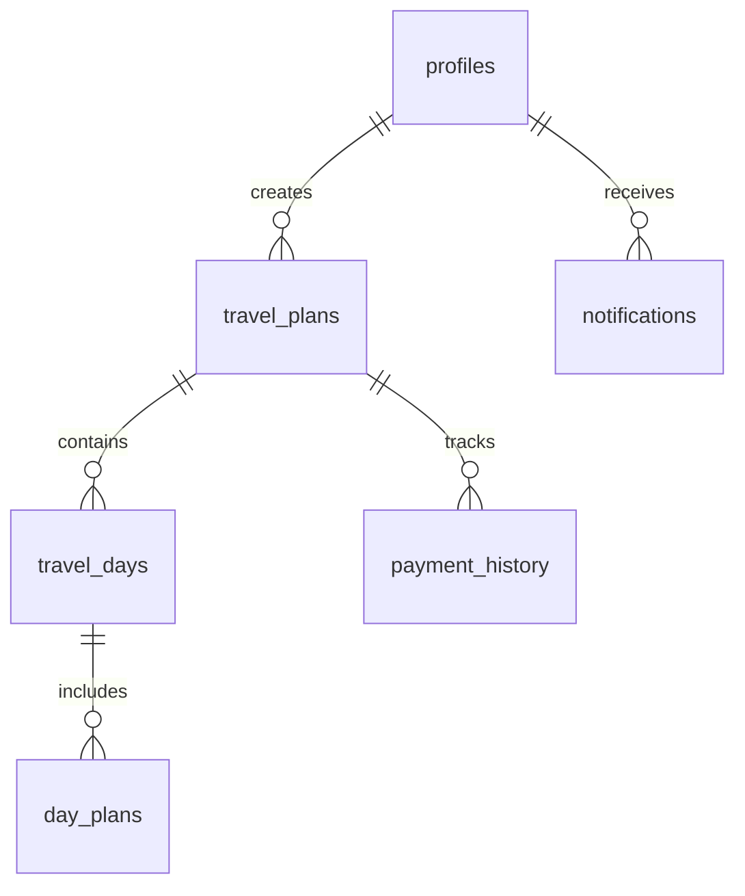

# Moonwave Travel v3.0 데이터베이스 가이드

> "가짜 흐름이 아닌, 실제 흐름으로 설계한다" - Supabase PostgreSQL 기반 여행 플래닝 시스템

## 📋 개요

이 가이드는 Moonwave Travel 프로젝트의 Supabase 데이터베이스 스키마를 설정하고 관리하는 방법을 다룹니다.

### 🗂 파일 구조

```
supabase/
├── migrations/
│   └── 001_initial_schema.sql    # 초기 데이터베이스 스키마
├── seed/
│   └── test_data.sql            # 테스트 데이터 시드
└── README.md                    # 이 파일
```

## 🚀 빠른 시작

### 1단계: Supabase 프로젝트 준비

1. [Supabase 대시보드](https://supabase.com/dashboard)에서 프로젝트 생성
2. 프로젝트 설정에서 데이터베이스 접속 정보 확인
3. SQL Editor 접속

### 2단계: 스키마 마이그레이션 실행

Supabase 대시보드의 SQL Editor에서 다음 파일들을 순서대로 실행:

```sql
-- 1. 초기 스키마 생성
-- migrations/001_initial_schema.sql 파일 내용 복사하여 실행

-- 2. 테스트 데이터 생성 (선택사항)
-- seed/test_data.sql 파일 내용 복사하여 실행
```

### 3단계: 환경 변수 설정

Next.js 프로젝트에서 다음 환경 변수 설정:

```bash
# .env.local
NEXT_PUBLIC_SUPABASE_URL=your_supabase_url
NEXT_PUBLIC_SUPABASE_ANON_KEY=your_supabase_anon_key
```

## 🗄 데이터베이스 스키마 개요

### 핵심 테이블 구조



### 테이블 상세 설명

#### 1. `profiles` - 사용자 프로필

```sql
-- 사용자 기본 정보 및 여행 통계
id UUID PRIMARY KEY               -- auth.users.id와 연결
email TEXT UNIQUE NOT NULL        -- 이메일 주소
name TEXT                         -- 사용자 이름
avatar_url TEXT                   -- 프로필 이미지
subscription_count INTEGER        -- 활성 여행 수
total_monthly_cost DECIMAL        -- 월 총 여행 예산
preferences JSONB                 -- 사용자 설정
timezone TEXT                     -- 시간대
```

#### 2. `travel_plans` - 여행 계획

```sql
-- 여행 기본 정보
id UUID PRIMARY KEY               -- 여행 고유 ID
user_id UUID                      -- 생성자 ID
title TEXT NOT NULL               -- 여행 제목
destination TEXT NOT NULL         -- 목적지
start_date, end_date DATE         -- 여행 기간
description TEXT                  -- 설명
cover_image_url TEXT              -- 대표 이미지
is_public BOOLEAN                 -- 공개 여부
status TEXT                       -- 상태 (planning/ongoing/completed/cancelled)
collaborators TEXT[]              -- 협업자 목록
```

#### 3. `travel_days` - 일자별 정보

```sql
-- 여행 일자별 기본 정보
id UUID PRIMARY KEY               -- Day 고유 ID
travel_plan_id UUID               -- 여행 ID
day_number INTEGER                -- Day 번호 (1, 2, 3...)
date DATE                         -- 날짜
title TEXT                        -- Day 제목
theme TEXT                        -- Day 테마
```

#### 4. `day_plans` - 세부 계획

```sql
-- 일자별 상세 계획
id UUID PRIMARY KEY               -- 계획 고유 ID
travel_day_id UUID                -- Day ID
place_name TEXT NOT NULL          -- 장소명
place_address TEXT                -- 주소
google_place_id TEXT              -- Google Place ID
latitude, longitude DECIMAL       -- 좌표
planned_time TIME                 -- 예정 시간
duration_minutes INTEGER          -- 소요 시간
plan_type TEXT                    -- 계획 유형
notes TEXT                        -- 메모
image_urls TEXT[]                 -- 이미지 목록
budget DECIMAL                    -- 예산
order_index INTEGER               -- 순서
```

#### 5. `payment_history` - 결제 이력

```sql
-- 여행 관련 결제 기록
id UUID PRIMARY KEY               -- 결제 ID
travel_plan_id UUID               -- 여행 ID
day_plan_id UUID                  -- 계획 ID (선택)
amount DECIMAL NOT NULL           -- 금액
currency TEXT                     -- 통화
payment_date DATE                 -- 결제일
status TEXT                       -- 상태
payment_method TEXT               -- 결제 방법
receipt_url TEXT                  -- 영수증 URL
```

## 🔐 보안 정책 (RLS)

모든 테이블에 Row Level Security가 적용되어 사용자별 데이터 격리가 보장됩니다.

### 주요 정책

1. **개인 데이터 격리**: 사용자는 자신의 데이터만 접근 가능
2. **협업 지원**: `collaborators` 테이블을 통한 여행 공유
3. **공개 여행**: `is_public=true`인 여행은 모든 사용자가 조회 가능

## 🧪 테스트 데이터 사용법

### 테스트 데이터 생성

```sql
-- 1. 먼저 Supabase Auth를 통해 사용자 생성 (Google OAuth 등)
-- 2. 생성된 사용자의 UUID 확인
-- 3. 다음 함수 실행

SELECT public.create_sample_travel_data('your-user-uuid-here');
```

### 생성되는 테스트 데이터

- **서울 2박 3일 여행**: 강남, 홍대, 명동 핫플레이스 투어
- **제주도 3박 4일 여행**: 자연과 맛집을 즐기는 힐링 여행
- **상세 계획**: 각 여행별 Day별 상세 계획 및 예산
- **결제 이력**: 실제 결제 데이터 예시
- **알림**: 여행 전 리마인더 알림

### 테스트 데이터 확인

```sql
-- 생성된 데이터 확인
SELECT COUNT(*) as travel_plans FROM public.travel_plans;
SELECT COUNT(*) as day_plans FROM public.day_plans;
SELECT COUNT(*) as payment_history FROM public.payment_history;

-- 사용자 통계 확인
SELECT * FROM public.get_user_stats('your-user-uuid');
```

### 테스트 데이터 정리

```sql
-- 테스트 데이터 삭제
SELECT public.cleanup_test_data('your-user-uuid');
```

## 🔧 유용한 함수들

### 1. 사용자 통계 조회

```sql
SELECT * FROM public.get_user_stats('user-uuid');
-- 반환: total_travels, total_plans, total_spent, active_notifications
```

### 2. 여행 일자 자동 생성

```sql
-- travel_plans 삽입 시 자동으로 travel_days 생성
-- 트리거: generate_travel_days_trigger
```

### 3. 사용자 통계 자동 업데이트

```sql
-- travel_plans 변경 시 profiles.subscription_count 자동 업데이트
-- 트리거: update_travel_stats_trigger
```

## 📊 성능 최적화

### 인덱스

자주 사용되는 쿼리를 위한 인덱스가 자동 생성됩니다:

- `idx_travel_plans_user_id`: 사용자별 여행 조회
- `idx_travel_days_travel_plan_id`: 여행별 일자 조회
- `idx_day_plans_travel_day_id`: 일자별 계획 조회
- `idx_day_plans_google_place_id`: Google Place 검색
- `idx_notifications_user_id_is_read`: 읽지 않은 알림 조회

### 쿼리 예시

#### 여행 목록 조회 (관련 데이터 포함)

```sql
SELECT
  tp.*,
  COUNT(td.id) as total_days,
  COUNT(dp.id) as total_plans,
  COALESCE(SUM(ph.amount), 0) as total_spent
FROM travel_plans tp
LEFT JOIN travel_days td ON tp.id = td.travel_plan_id
LEFT JOIN day_plans dp ON td.id = dp.travel_day_id
LEFT JOIN payment_history ph ON tp.id = ph.travel_plan_id
WHERE tp.user_id = 'user-uuid'
GROUP BY tp.id
ORDER BY tp.created_at DESC;
```

#### 특정 여행의 전체 계획 조회

```sql
SELECT
  tp.title,
  td.day_number,
  td.date,
  dp.planned_time,
  dp.place_name,
  dp.plan_type,
  dp.budget
FROM travel_plans tp
JOIN travel_days td ON tp.id = td.travel_plan_id
JOIN day_plans dp ON td.id = dp.travel_day_id
WHERE tp.id = 'travel-plan-uuid'
ORDER BY td.day_number, dp.order_index;
```

## 🔄 실시간 구독 설정

Next.js 애플리케이션에서 실시간 데이터 동기화:

```typescript
// 여행 계획 실시간 구독
const subscription = supabase
  .channel('travel_plans_realtime')
  .on(
    'postgres_changes',
    {
      event: '*',
      schema: 'public',
      table: 'travel_plans',
      filter: `user_id=eq.${user.id}`,
    },
    (payload) => {
      // UI 업데이트 로직
    }
  )
  .subscribe();
```

## 🚨 주의사항

1. **RLS 정책**: 모든 쿼리는 RLS 정책에 따라 필터링됩니다
2. **사용자 인증**: 데이터 접근 전 반드시 Supabase Auth 인증 필요
3. **외래키 제약**: 연쇄 삭제가 설정되어 있으므로 삭제 시 주의
4. **타입 안전성**: TypeScript 타입 정의 활용 권장

## 📚 추가 자료

- [Supabase Documentation](https://supabase.com/docs)
- [PostgreSQL Documentation](https://www.postgresql.org/docs/)
- [Row Level Security Guide](https://supabase.com/docs/guides/auth/row-level-security)

---

**Moonwave Travel Database v1.0**  
_실제 흐름 중심의 여행 플래닝 데이터베이스_  
_Created: 2025-07-26_
